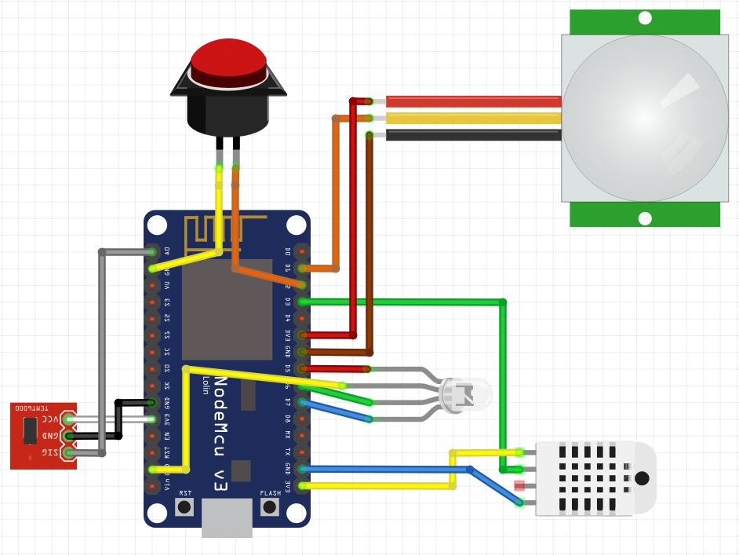

pipersense
==========

This is a firmware designed for multisensor devices based on nodemcu V2 board communitacting over Wifi and MQTT communication protocol. The main purpose of this firmware is to perform as best with [Home Assistant](home-assistant.io).

It is designed with these features in mind:
- Simple low coupled clases with all functionality ([esp8266-utils](https://github.com/danimtb/esp8266-utils) -Relay, LED, Button, WifiManager, MqttManager, DataManager (EEPROM)...).
- Easy to use and reusable to create firmware for other devices.
- C++ code and Arduino interface approach (``setup()``, ``loop()``).

It's capabilities are:
- Fast connection to Wifi network and MQTT broker.
- Publish device information and state topics to MQTT at connection start and periodically.
- ArduinoOTA to target devices flashing a new firmware over Wifi.
- Automatic Updates from devices calling an Update Server with new releases.

Supported devices
-----------------

### Nodemcu V2

